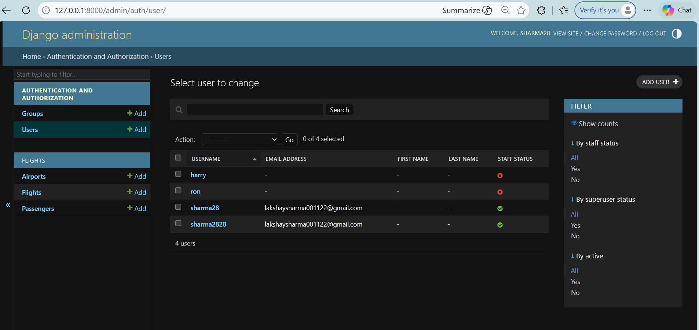
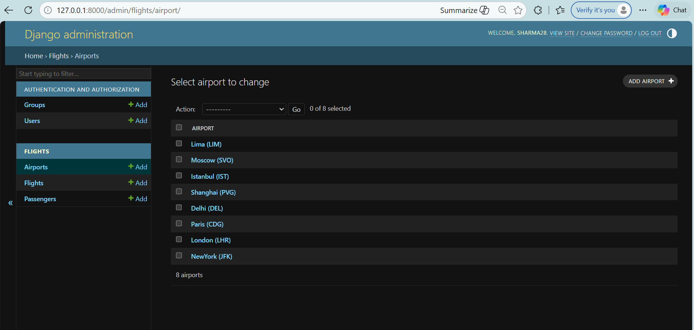
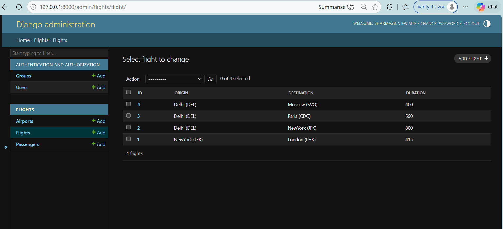
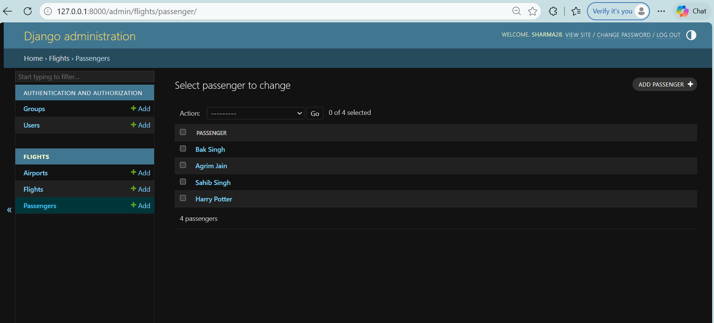
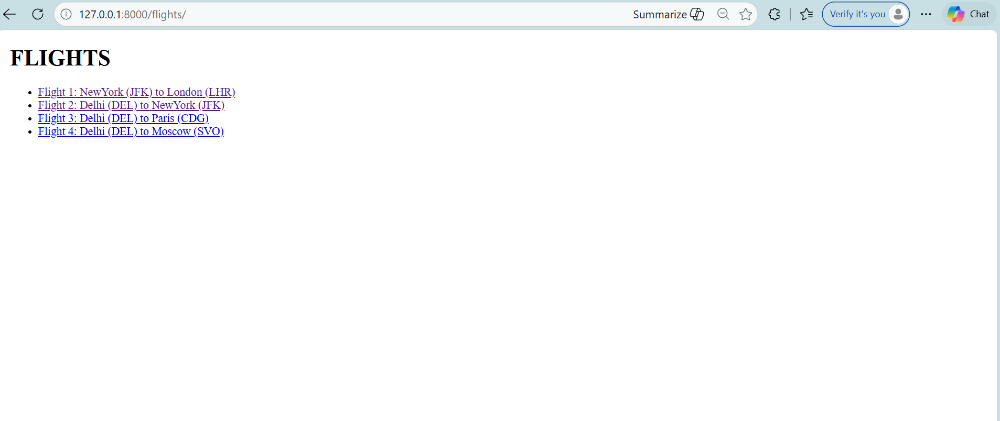
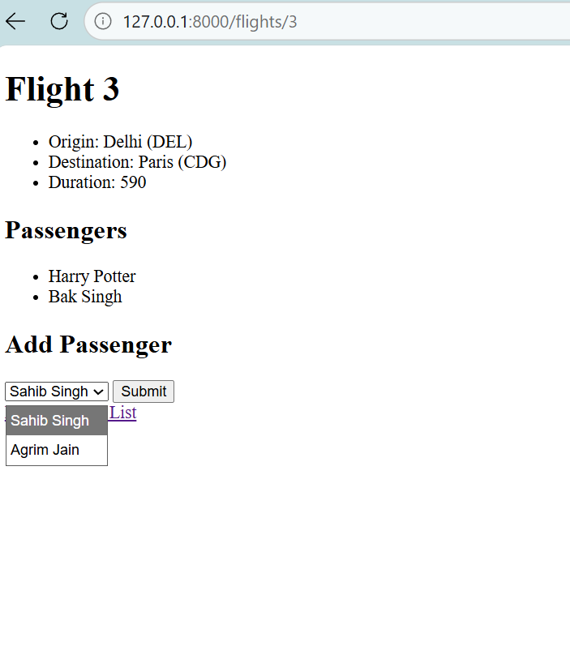
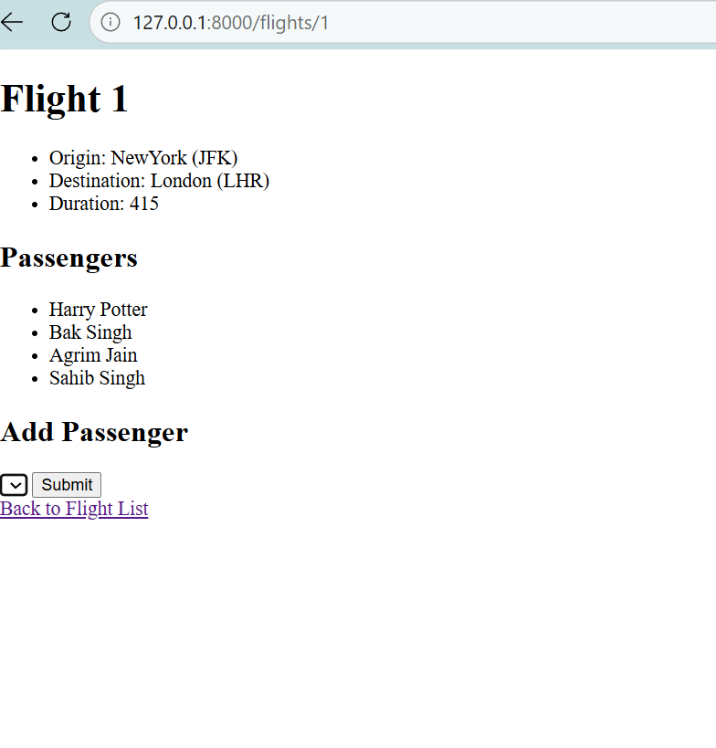

Django Airline Management System

A web-based Airline Management System built using Django Framework that allows administrators to manage airports, flights, and passengers, and allows users to view flight details and assign passengers to flights.
This project demonstrates Django Models, Admin Panel Customization, Database Relationships, Forms Handling, and Dynamic Routing.

**Features**

Admin Authentication System
Secure Django Admin Login
Superuser control over system data

**Airport Management**

Add / Edit / Delete Airports
Store airport name and code

**Flight Management**

Create flights with origin, destination, and duration
View list of all flights
View detailed page for each flight

**Passenger Management**

Add passengers
Assign passengers to specific flights
Prevent duplicate passenger assignment

**Flight Detail Page**

*Shows:*

Origin
Destination
Duration
List of passengers
Dropdown form to add new passengers

**Concepts Used**

Django Models
ForeignKey Relationships
ManyToMany Relationships
Django Admin Customization
Django Forms
URL Routing & Dynamic URLs
Template Rendering
Database Queries

**Tech Stack**

Backend: Django (Python)
Database: SQLite
Frontend: HTML (Django Templates)
Admin UI: Django Default Admin

**Screenshots:**

**Admin Panel:**

**User Interface:**

